# OCI AI Data Platform

## 🎯 **Objetivos**

Descobrir como utilizar de forma prática o serviço OCI AI Data Platform em conjunto com o Oracle Autonomous e OCI Data Flow. O workshop terá como objetivo mostrar como montar um pipeline fim a fim utilizando o AIDP e autonomous como ambiente de experimentação e desenvolvimento de dados e também apresentar como reutilizar os codigos para deployment no oci data flow 

O que você aprenderá:

- Preparar a infraestrutura do OCI AI Data Platform.
- Criar workspace e cluster Spark.
- Realizar verificações de qualidade e análise exploratória dos dados.
- Criar as camadas da arquitetura medalhão com PySpark e autonomous.
- Utilizar o VS Code como ferramenta de desenvolvimento e interação com o AIDP
- Converter códigos criados no AIDP para execução no OCI Data Flow

### _**Aproveite sua experiência na Oracle Cloud!**_

## 📌 Introdução

> **O laboratório implementa um pipeline de dados em camadas. O processamento é realizado no OCI AI Data Platform com notebooks e Spark. Neste workshop, trabalharemos um dataset CSV, processaremos os dados usando o AIDP e, por fim, disponibilizaremos os dados em um Autonomous Database na OCI**

# **Parte 1 - Hands On AI Data Platform**

## **1️⃣ Preparação da infraestrutura**

Antes de iniciar o Hands On, prepare os recursos necessários:

1.  Crie **uma instância AI Data Platform**.

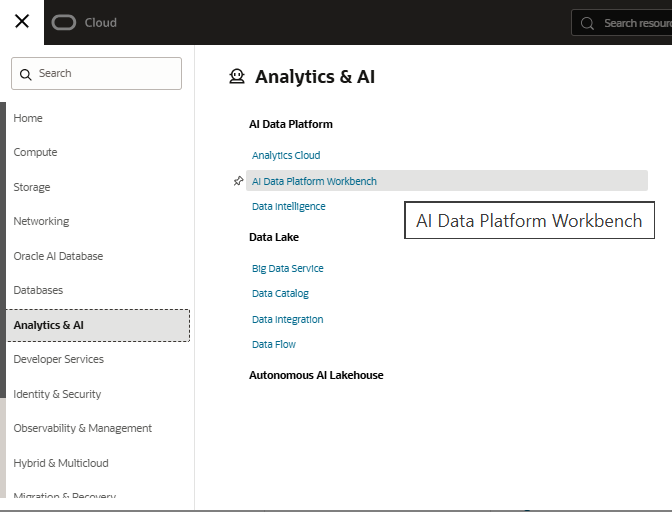

Dê um nome para seu ambiente e preencha-o como o exemplo abaixo

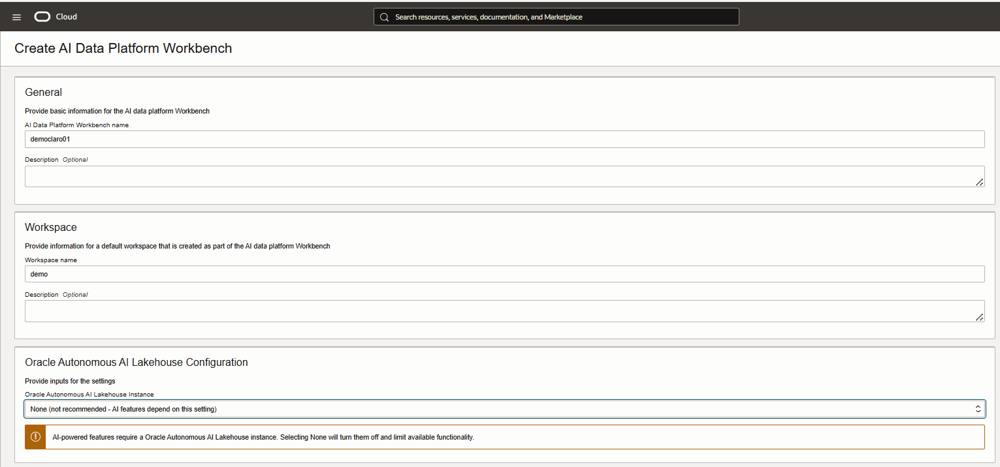

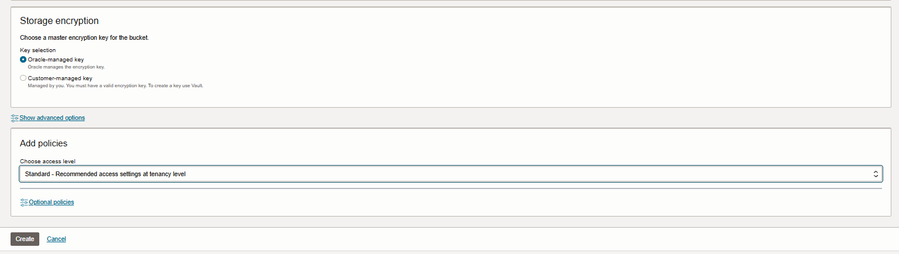

> **⚠️ ATENÇÃO:** A criação da sua instância AIDP deve demorar cerca de uns 10 minutos para conclusão.

2.  Crie **um autonomous database**.

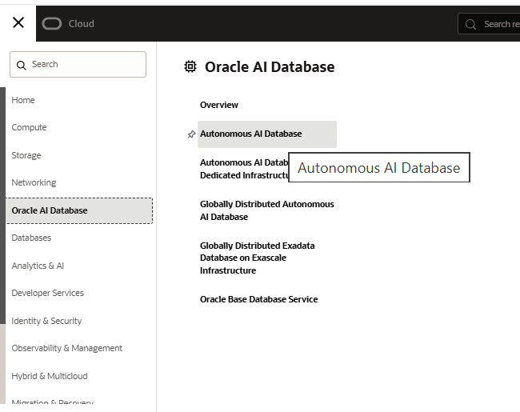

Preencha o formulário de acordo com o exemplo. Use a senha **WORKSHOPsec2019##**

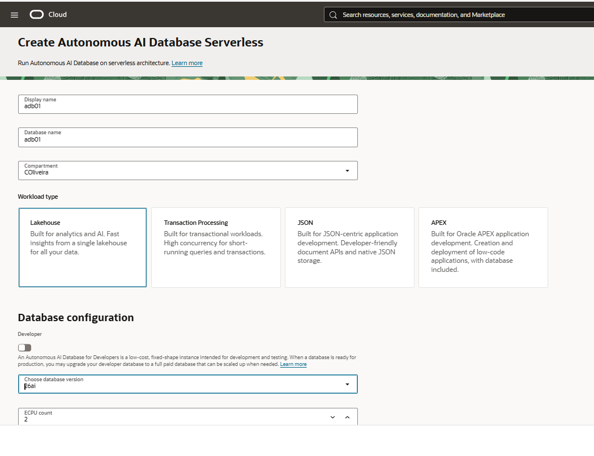

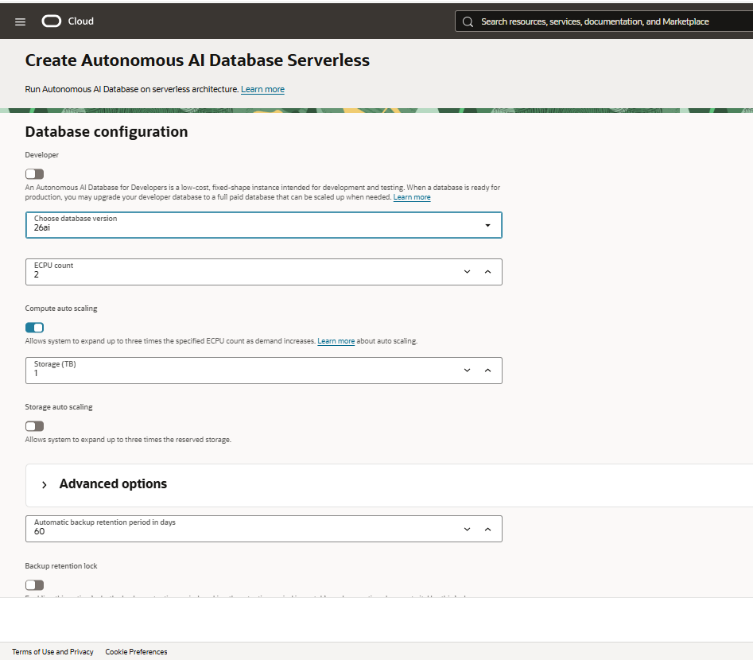

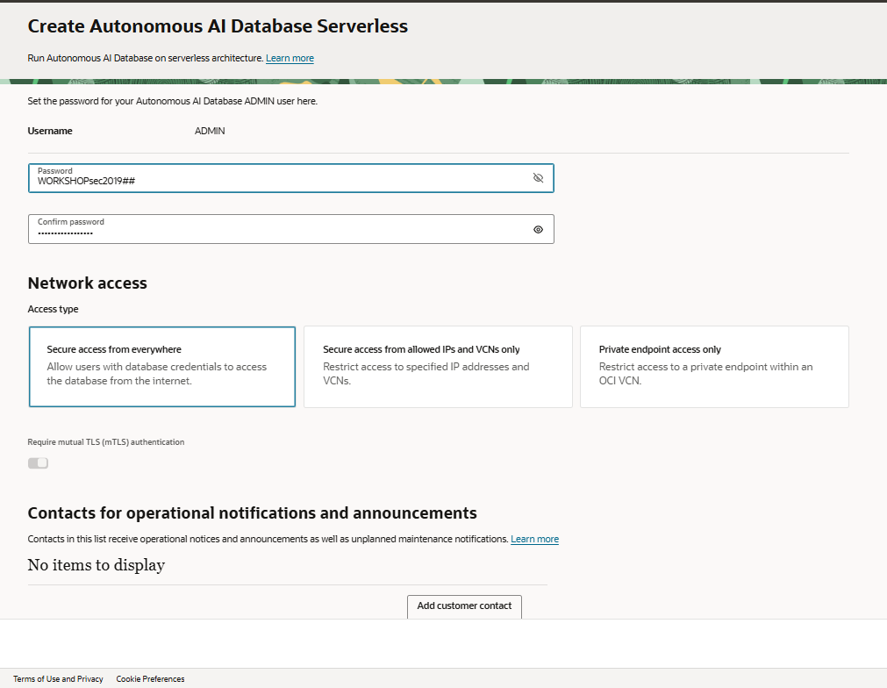

3.  Crie **um bucket**

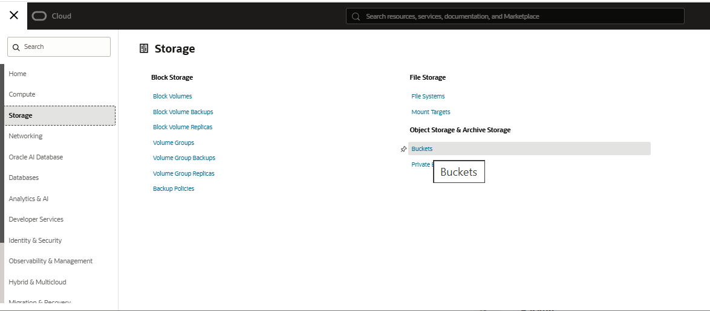

Preencha o formulário conforme o exemplo

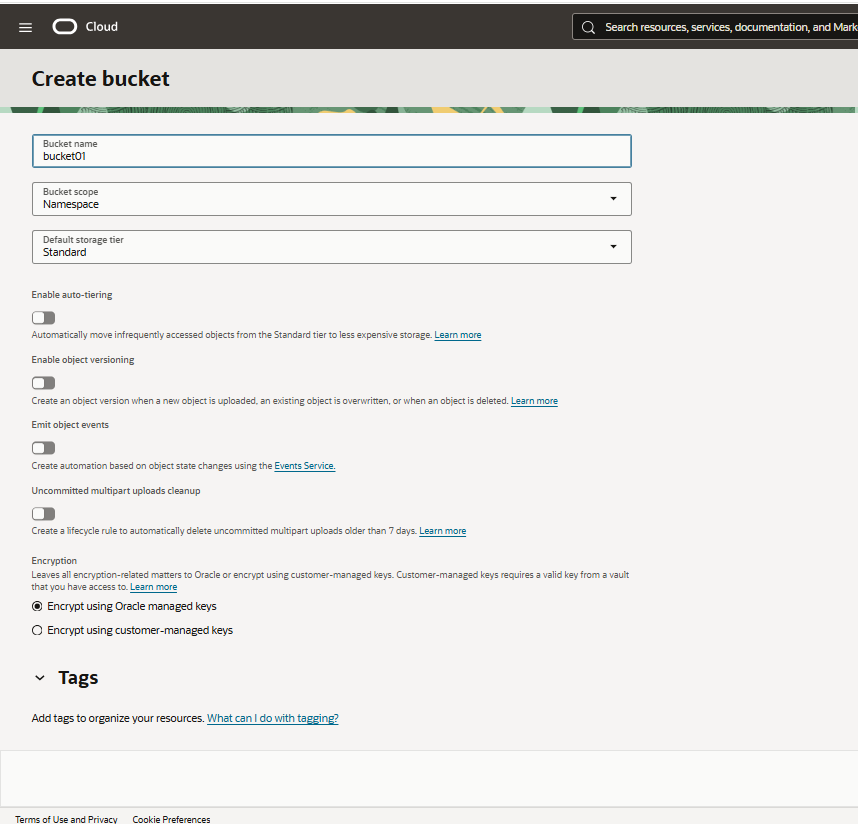

4.  Configure a wallet do DB Autonomous

Navegue até o seu autonomous criado na etapa anterior e faça o download da wallet. Use a senha **WORKSHOPsec2019##**

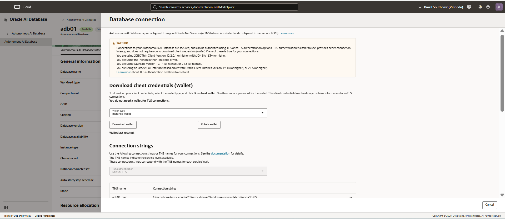

Siga até o seu bucket, crie uma pasta chamada wallet, clique na pasta e faça o upload do arquivo .zip (sua wallet)

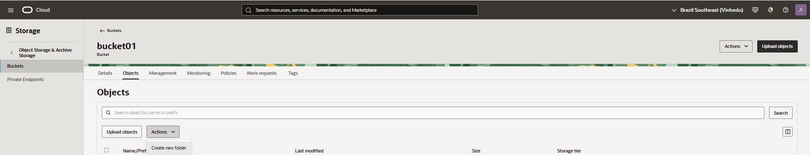

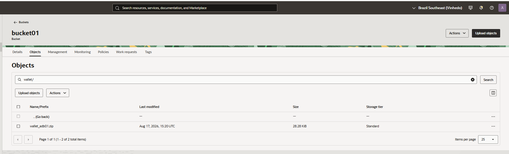


5.  Crie **um workspace e um spark cluster no AIDP**

No OCI, navegue de volta para o AIDP e clique na sua instância recem criada. Clique em workspaces e no botão create

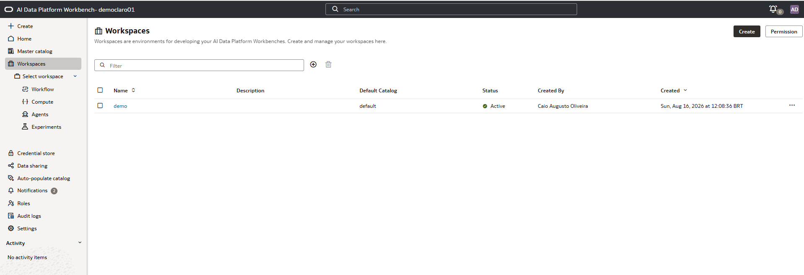

Dê o nome de workspace01 e faça a criação

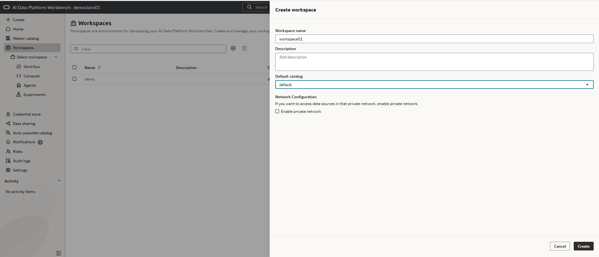

Concluida a criação, clique no workspace01. No canto esquerdo clique em compute e depois no botão de + (ao lado do campo de filtro). Faça a criação do cluster conforme print abaixo

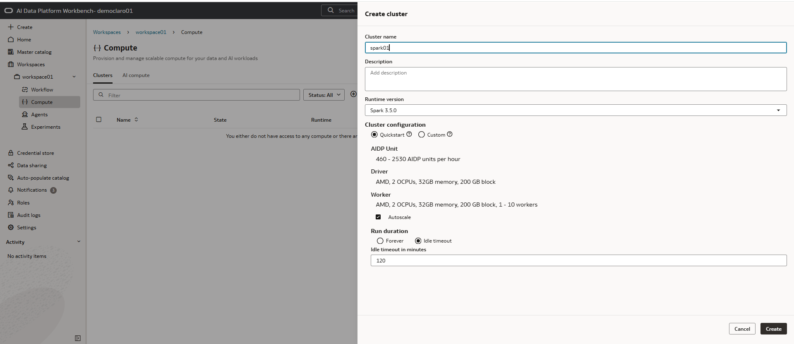

6. Monte a integração da extensão VS Code com seu ambiente AIDP

Na aba de extensões deo VS Code, digite AI Data Platform e faça a instalação da extensão

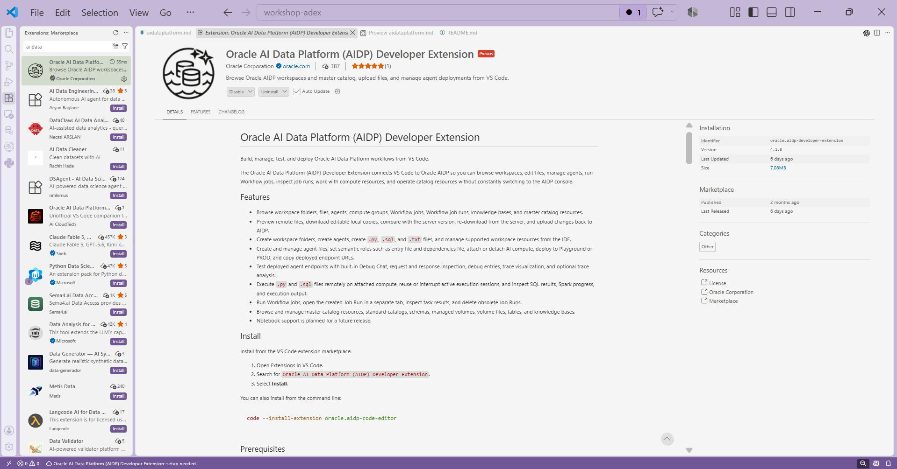

Clique no ícone da extensão no canto esquerdo do VS Code, depois em begin setup e escolha browser login default

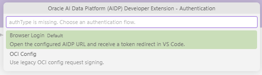

Copie e cole a URL do AIDP da página home no VS Code e faça a autenticação

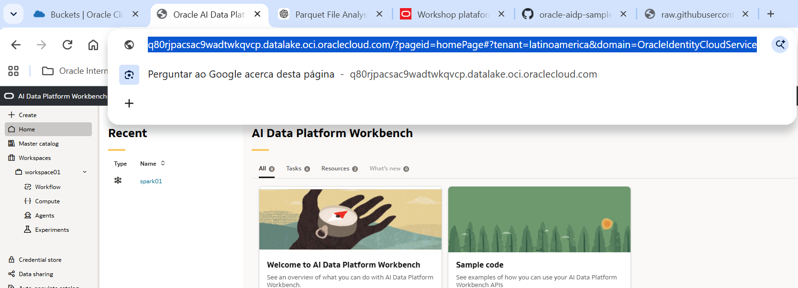

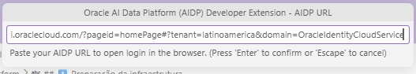

7.  Inicie o Hands On.

## **2️⃣ Criação da camada Bronze**

Nessa etapa faremos o download de 2 datasets em CSV e faremos a escrita dos mesmos no bucket criado na etapa anterior. No OCI navegue até o seu bucket e colete o namespace do seu ambiente conforme a imagem abaixo. Anote essa informação pois a usaremos em outras etapas do workshop

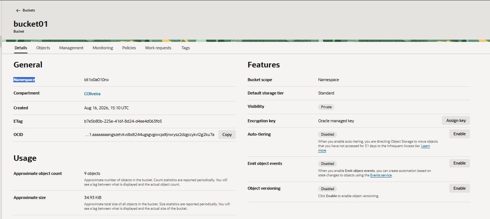

Na extensão do AIDP no VS Code, primeiramente veja se o workspace01 esta selecionado (caso não esteja clique com o botão direto e change workspace)

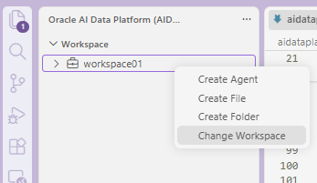

Depois clique com o botão direito e create file, dê o nome de `script_bronze.py`

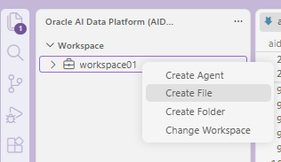

Copie e cole o código abaixo e faça a alteração do namespace conforme indicação

```python
import urllib.request
orders_url = ("https://raw.githubusercontent.com/caiogusto2/workshop-dataplatform/main/aidataplatform/arquivos_csv/orders.csv")
customers_url = ("https://raw.githubusercontent.com/caiogusto2/workshop-dataplatform/main/aidataplatform/arquivos_csv/customers.csv")

base_path = "oci://bucket01@TROCAR_AQUI_NAMESPACE/parquet"

orders_path = f"{base_path}/orders"
customers_path = f"{base_path}/customers"

with urllib.request.urlopen(orders_url) as response:orders_content = response.read().decode("utf-8")
with urllib.request.urlopen(customers_url) as response:customers_content = response.read().decode("utf-8")

df_orders = (
    spark.read
    .option("header", "true")
    .option("inferSchema", "true")
    .option("sep", ";")
    .csv(spark.sparkContext.parallelize(orders_content.splitlines()))
)

df_customers = (
    spark.read
    .option("header", "true")
    .option("inferSchema", "true")
    .option("sep", ";")
    .csv(spark.sparkContext.parallelize(customers_content.splitlines()))
)

df_orders.write.mode("overwrite").parquet(orders_path)
df_customers.write.mode("overwrite").parquet(customers_path)

print("Parquet datasets created successfully:")
print(orders_path)
print(customers_path)
```

Na extensão do VS Code clique em push to the server

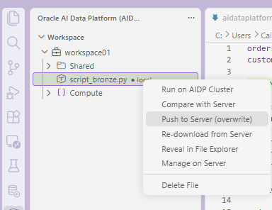

Clique em run on AIDP Cluster e depois selecione o seu cluster na aba superior

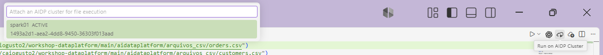

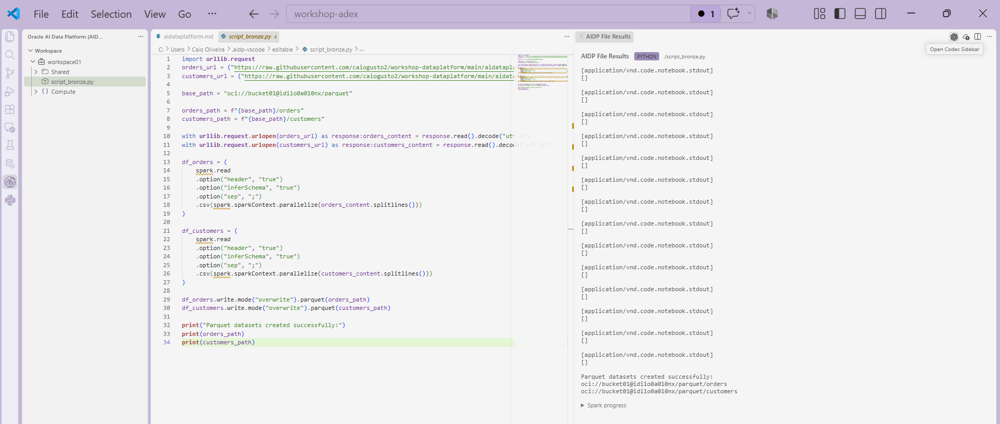

### **➡️ Análise exploratória da camada Bronze**

Agora faremos a análise exploratória dos dados recém descarregados. Crie um novo arquivo python com o nome `explora_bronze.py`.

Copie e cole o código abaixo e faça a alteração do namespace conforme indicação

```python
orders_path = "oci://bucket01@TROCAR_AQUI_NAMESPACE/parquet/orders"
customers_path = "oci://bucket01@TROCAR_AQUI_NAMESPACE/parquet/customers"

orders_df = spark.read.parquet(orders_path)
customers_df = spark.read.parquet(customers_path)

orders_df.createOrReplaceTempView("orders")
customers_df.createOrReplaceTempView("customers")

print("=== DESCRIBE TABLE: orders ===")
spark.sql("DESCRIBE TABLE orders").show(200, truncate=False)

print("=== DESCRIBE TABLE: customers ===")
spark.sql("DESCRIBE TABLE customers").show(200, truncate=False)

print("=== SAMPLE: orders ===")
spark.sql("SELECT * FROM orders LIMIT 10").show(10, truncate=False)

print("=== SAMPLE: customers ===")
spark.sql("SELECT * FROM customers LIMIT 10").show(10, truncate=False)

print("=== ORDERS DATA QUALITY ===")
spark.sql("""
SELECT
  COUNT(*) AS row_count,
  SUM(CASE WHEN CUSTOMER_ID IS NULL THEN 1 ELSE 0 END) AS customer_id_nulls,
  SUM(CASE WHEN ORDER_ID IS NULL THEN 1 ELSE 0 END) AS order_id_nulls,
  SUM(CASE WHEN ORDER_DATE IS NULL THEN 1 ELSE 0 END) AS order_date_nulls,
  SUM(CASE WHEN ORDER_TOTAL IS NULL THEN 1 ELSE 0 END) AS order_total_nulls,
  SUM(CASE WHEN COST_OF_DELIVERY IS NULL THEN 1 ELSE 0 END) AS cost_of_delivery_nulls,
  MIN(ORDER_TOTAL) AS min_order_total,
  MAX(ORDER_TOTAL) AS max_order_total,
  AVG(ORDER_TOTAL) AS avg_order_total,
  MIN(COST_OF_DELIVERY) AS min_cost_of_delivery,
  MAX(COST_OF_DELIVERY) AS max_cost_of_delivery,
  AVG(COST_OF_DELIVERY) AS avg_cost_of_delivery
FROM orders
""").show(truncate=False)

print("=== CUSTOMERS DATA QUALITY ===")
spark.sql("""
SELECT
  COUNT(*) AS row_count,
  SUM(CASE WHEN CUSTOMER_ID IS NULL THEN 1 ELSE 0 END) AS customer_id_nulls,
  SUM(CASE WHEN CUST_FIRST_NAME IS NULL THEN 1 ELSE 0 END) AS cust_first_name_nulls,
  SUM(CASE WHEN CUST_LAST_NAME IS NULL THEN 1 ELSE 0 END) AS cust_last_name_nulls,
  SUM(CASE WHEN CUST_EMAIL IS NULL THEN 1 ELSE 0 END) AS cust_email_nulls,
  SUM(CASE WHEN CREDIT_LIMIT IS NULL THEN 1 ELSE 0 END) AS credit_limit_nulls,
  MIN(CREDIT_LIMIT) AS min_credit_limit,
  MAX(CREDIT_LIMIT) AS max_credit_limit,
  AVG(CREDIT_LIMIT) AS avg_credit_limit
FROM customers
""").show(truncate=False)

print("=== DUPLICATE ORDERS ===")
spark.sql("""
SELECT CUSTOMER_ID, ORDER_ID, COUNT(*) AS cnt
FROM orders
GROUP BY CUSTOMER_ID, ORDER_ID
HAVING COUNT(*) > 1
ORDER BY cnt DESC
""").show(truncate=False)

print("=== DUPLICATE CUSTOMERS ===")
spark.sql("""
SELECT CUSTOMER_ID, COUNT(*) AS cnt
FROM customers
GROUP BY CUSTOMER_ID
HAVING COUNT(*) > 1
ORDER BY cnt DESC
""").show(truncate=False)
```

Salve o arquivo localmente, clique com o botão direito para fazer o push to server e execute o notebook usando um cluster spark (similar ao que foi feito na etapa anterior)

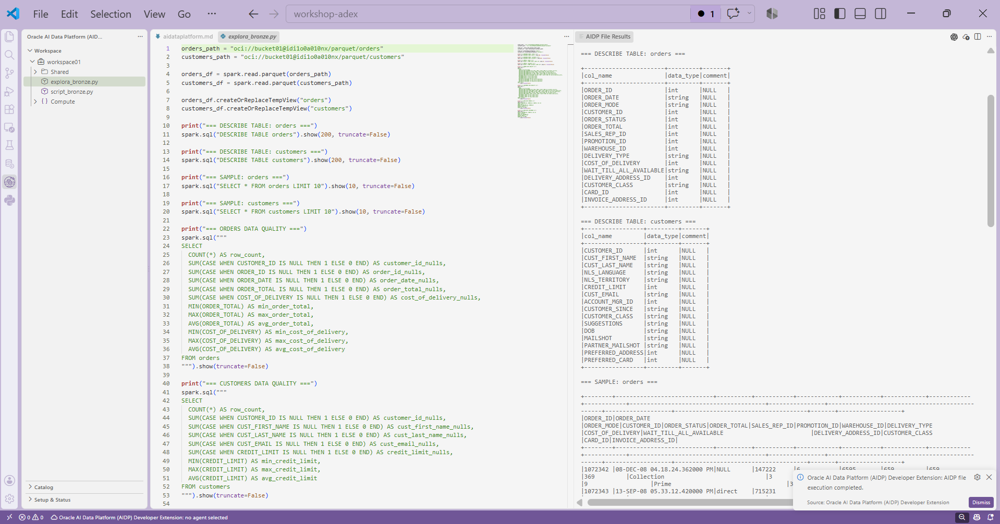

## **3️⃣ Criação da camada Silver**

Na camada Silver começaremos a interagir com o Autonomous Database criado nesse workshop. Na extensão do VS Code, crie um novo arquivo chamado `script_silver.py`. Copie e cole o conteudo abaixo realizando as alterações necessárias: `TROCAR_AQUI_NAMESPACE`

```python
from pyspark.sql import functions as F
import base64

oss_path = "oci://bucket01@TROCAR_AQUI_NAMESPACE"

base_path = f"{oss_path}/parquet"
catalog_location = f"{oss_path}/staging"

orders_path = f"{base_path}/orders"
customers_path = f"{base_path}/customers"

# Wallet no Object Storage
wallet_uri = f"{oss_path}/wallet/wallet_adb01.zip"

# Oracle ADB / AI Lakehouse
alh_tns = "adb01_high"
alh_user = "ADMIN"
alh_password = "WORKSHOPsec2019##"
alh_schema = "ADMIN"
target_table = "CUSTOMERS_ORDERS"

df_orders = spark.read.parquet(orders_path)
df_customers = spark.read.parquet(customers_path)

print(f"Orders:    {df_orders.count()}")
print(f"Customers: {df_customers.count()}")

df_join = (
    df_orders.alias("o")
    .join(
        df_customers.alias("c"),
        on="CUSTOMER_ID",
        how="inner"
    )
)

silver_df = df_join.select(
    F.col("CUSTOMER_ID"),
    F.col("ORDER_ID"),
    F.col("ORDER_DATE"),
    F.col("ORDER_MODE"),
    F.col("ORDER_STATUS"),
    F.col("ORDER_TOTAL"),
    F.col("SALES_REP_ID"),
    F.col("PROMOTION_ID"),
    F.col("WAREHOUSE_ID"),
    F.col("DELIVERY_TYPE"),
    F.col("COST_OF_DELIVERY"),
    F.col("WAIT_TILL_ALL_AVAILABLE"),
    F.col("DELIVERY_ADDRESS_ID"),
    F.col("o.CUSTOMER_CLASS").alias("ORDER_CUSTOMER_CLASS"),
    F.col("CARD_ID"),
    F.col("INVOICE_ADDRESS_ID"),
    F.col("CUST_FIRST_NAME"),
    F.col("CUST_LAST_NAME"),
    F.col("NLS_LANGUAGE"),
    F.col("NLS_TERRITORY"),
    F.col("CREDIT_LIMIT"),
    F.col("CUST_EMAIL"),
    F.col("ACCOUNT_MGR_ID"),
    F.col("CUSTOMER_SINCE"),
    F.col("c.CUSTOMER_CLASS").alias("CUSTOMER_CLASS"),
    F.col("SUGGESTIONS"),
    F.col("DOB"),
    F.col("MAILSHOT"),
    F.col("PARTNER_MAILSHOT"),
    F.col("PREFERRED_ADDRESS"),
    F.col("PREFERRED_CARD")
)

silver_df = (
    silver_df
    .withColumn(
        "ORDER_DATE",
        F.to_timestamp(
            F.trim(F.col("ORDER_DATE")),
            "dd-MMM-yy hh.mm.ss.SSSSSS a"
        )
    )
    .withColumn(
        "CUSTOMER_SINCE",
        F.to_date(
            F.trim(F.col("CUSTOMER_SINCE")),
            "dd-MMM-yy"
        )
    )
    .withColumn(
        "DOB",
        F.to_date(
            F.trim(F.col("DOB")),
            "dd-MMM-yy"
        )
    )
)

row_count = silver_df.count()
print(f"Silver row count: {row_count}")

silver_df.printSchema()
silver_df.show(10, truncate=False)
print("Carregando wallet...")

wallet_df = (
    spark.read
    .format("binaryFile")
    .load(wallet_uri)
)

wallet_rows = wallet_df.select("content").collect()

if len(wallet_rows) != 1:
    raise RuntimeError(
        f"Esperado exatamente 1 arquivo de wallet, "
        f"mas foram encontrados {len(wallet_rows)}."
    )

wallet_bytes = wallet_rows[0]["content"]

if not wallet_bytes:
    raise RuntimeError("wallet.zip está vazio.")

print(f"Wallet carregada: {len(wallet_bytes)} bytes")

wallet_content = (
    base64
    .b64encode(wallet_bytes)
    .decode("ascii")
)

print(
    f"Wallet convertida para Base64: "
    f"{len(wallet_content)} caracteres"
)

print(
    f"Gravando {row_count} linhas em "
    f"{alh_schema}.{target_table}..."
)

(
    silver_df.write
    .format("aidataplatform")
    .mode("overwrite")
    .option("type", "ORACLE_ALH")
    .option("tns", alh_tns)
    .option("wallet.content", wallet_content)
    .option("user.name", alh_user)
    .option("password", alh_password)
    .option("schema", alh_schema)
    .option("table", target_table)
    .option("catalog_location", catalog_location)
    .save()
)

print(
    f"Dados gravados com sucesso em "
    f"{alh_schema}.{target_table}"
)
```

Salve o arquivo, faça o push to server e execute o script

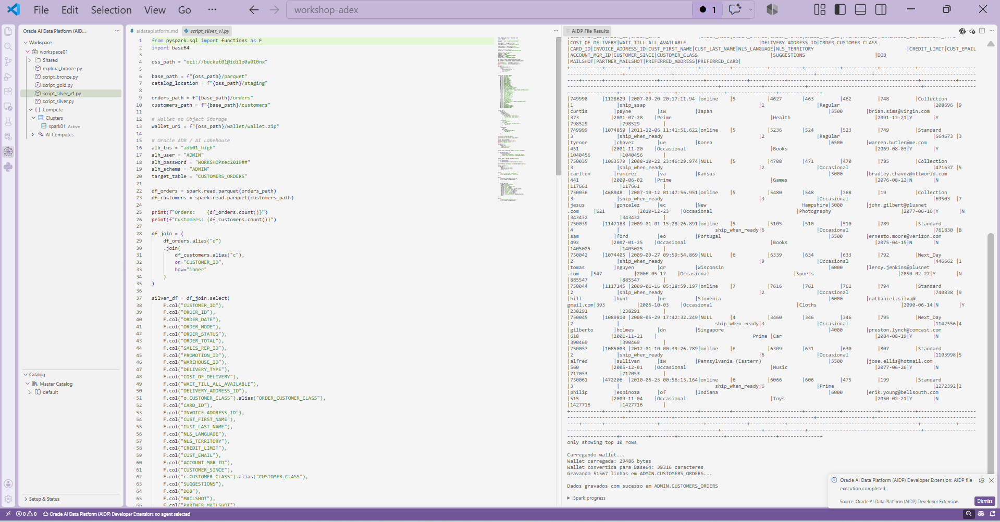

## **4️⃣ Criação da camada Gold**

Agora para a camada gold faremos uma pequena agregação. Crie um novo arquivo chamado `script_gold.py`. Copie e cole o conteudo abaixo

```python
from pyspark.sql import functions as F
import base64

oss_path = "oci://bucket01@TROCAR_AQUI_NAMESPACE"
base_path = f"{oss_path}/parquet"
catalog_location = f"{oss_path}/staging"
wallet_uri = f"{oss_path}/wallet/wallet_adb01.zip"

alh_tns = "adb01_high"
alh_user = "ADMIN"
alh_password = "WORKSHOPsec2019##"
alh_schema = "ADMIN"

source_table = "CUSTOMERS_ORDERS"
gold_table = "CUSTOMER_CLASS_AGG_REVIEW"

print("Carregando wallet...")
wallet_df = (
    spark.read
    .format("binaryFile")
    .load(wallet_uri)
)

wallet_rows = wallet_df.select("content").collect()
if len(wallet_rows) != 1:
    raise RuntimeError(
        f"Esperado exatamente 1 arquivo de wallet, "
        f"mas foram encontrados {len(wallet_rows)}."
    )
wallet_bytes = wallet_rows[0]["content"]
if not wallet_bytes:
    raise RuntimeError("wallet.zip está vazio.")

print(f"Wallet carregada: {len(wallet_bytes)} bytes")
wallet_content = (
    base64
    .b64encode(wallet_bytes)
    .decode("ascii")
)
print(
    f"Wallet convertida para Base64: "
    f"{len(wallet_content)} caracteres"
)

print(
    f"Lendo {alh_schema}.{source_table} "
    "via AIDATAPLATFORM..."
)

df_silver = (
    spark.read
    .format("aidataplatform")
    .option("type", "ORACLE_ALH")
    .option("tns", alh_tns)
    .option("wallet.content", wallet_content)
    .option("user.name", alh_user)
    .option("password", alh_password)
    .option("schema", alh_schema)
    .option("table", source_table)
    .load()
)

print("=== SILVER DATA ===")
df_silver.printSchema()
source_count = df_silver.count()
print(
    f"{source_table} rows: {source_count}"
)

if source_count > 0:
    df_silver.select(
        "CUSTOMER_ID",
        "ORDER_ID",
        "ORDER_DATE",
        "ORDER_TOTAL",
        "CUSTOMER_CLASS"
    ).show(10, truncate=False)

else:
    print(
        f"{source_table} está vazio."
    )

df_silver = (
    df_silver
    .withColumn(
        "ORDER_TOTAL",
        F.col("ORDER_TOTAL").cast("decimal(18,2)")
    )
)

df_norm = (
    df_silver
    .withColumn(
        "CUSTOMER_CLASS_NORM",
        F.trim(
            F.regexp_replace(
                F.regexp_replace(
                    F.upper(
                        F.col("CUSTOMER_CLASS")
                    ),
                    u"\u00A0",
                    " "
                ),
                r"\s+",
                " "
            )
        )
    )
)

df_gold = (
    df_norm
    .groupBy("CUSTOMER_CLASS_NORM")
    .agg(
        F.count("ORDER_ID").alias("TOTAL_ORDERS"),

        F.round(
            F.sum("ORDER_TOTAL"),
            2
        ).alias("TOTAL_SALES"),

        F.round(
            F.avg("ORDER_TOTAL"),
            2
        ).alias("AVG_ORDER_VALUE")
    )
    .orderBy(
        F.col("TOTAL_ORDERS").desc()
    )
)

print("=== GOLD AGGREGATION ===")
df_gold.printSchema()
df_gold.show(truncate=False)
gold_count = df_gold.count()
print(
    f"Gold rows: {gold_count}"
)

if gold_count > 0:
    print(
        f"Gravando {gold_count} linhas em "
        f"{alh_schema}.{gold_table}..."
    )

    (
        df_gold.write
        .format("aidataplatform")
        .mode("overwrite")
        .option("type", "ORACLE_ALH")
        .option("tns", alh_tns)
        .option("wallet.content", wallet_content)
        .option("user.name", alh_user)
        .option("password", alh_password)
        .option("schema", alh_schema)
        .option("table", gold_table)
        .option("catalog_location", catalog_location)
        .save()
    )

    print(
        f"Gold gravada com sucesso em "
        f"{alh_schema}.{gold_table}"
    )

else:

    print(
        "Nenhum registro Gold foi produzido. "
        "A tabela Gold não será sobrescrita."
    )

print(
    f"Lendo novamente {alh_schema}.{gold_table} "
    "para validação..."
)

df_gold_verify = (
    spark.read
    .format("aidataplatform")
    .option("type", "ORACLE_ALH")
    .option("tns", alh_tns)
    .option("wallet.content", wallet_content)
    .option("user.name", alh_user)
    .option("password", alh_password)
    .option("schema", alh_schema)
    .option("table", gold_table)
    .load()
)

gold_db_count = df_gold_verify.count()
print(
    f"{gold_table} rows in ADB: "
    f"{gold_db_count}"
)
print("=== GOLD TABLE IN ADB ===")
(
    df_gold_verify
    .orderBy(
        F.col("TOTAL_ORDERS").desc()
    )
    .show(
        truncate=False
    )
)
print("Oracle/ADB validation completed successfully")
```

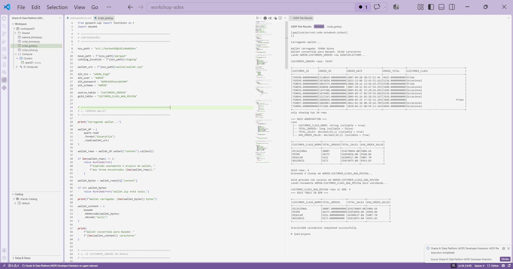

## **5️⃣ Debug e análise de planos e execução**

Na extensão do VS Code, clique na aba de compute e com o botão direito no spark01 Manage on Server (Clique em open)

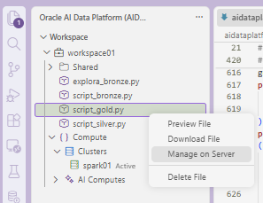

Navegue pelos componentes do seu cluster, abaixo uma descrição de algumas das telas disponíveis

**Detalhes:** Mostra informações sobre o cluster hoje em utilização

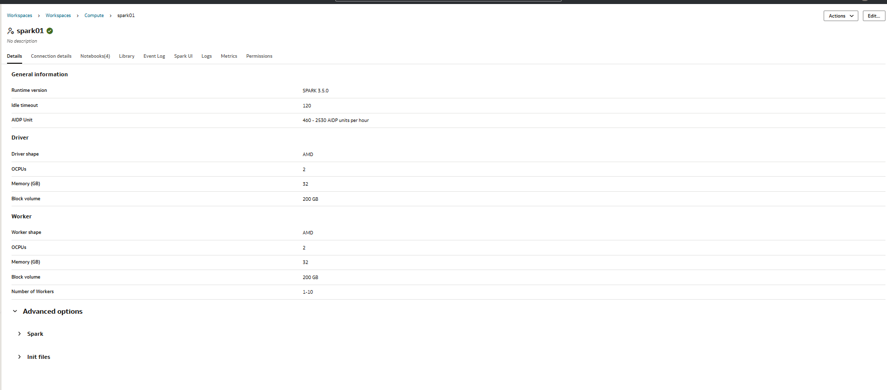

**Connection Details:** Mostra alternativas para conectar no cluster através de ferramentas de data viz e outros softwares

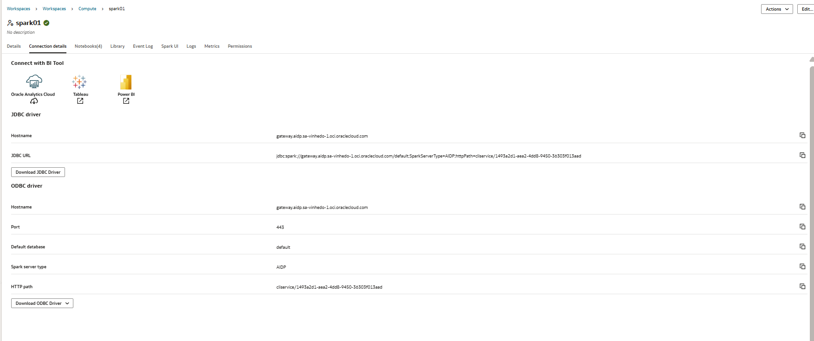

**Notebooks:** mostra os scripts que utilizam esse cluster spark

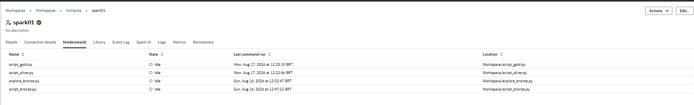

**Library:** possibilita a importação de arquivos .jar, criação de arquivos prerequisites para instalação de packages python e outras funcionalidades. Packages instaladas aqui, ficam disponíveis no cluster e não requerem instalações no runtime

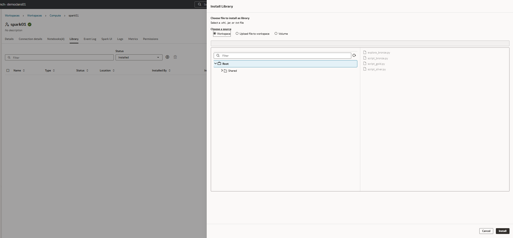

**Event logs:** mostra informações do cluster spark de forma geral

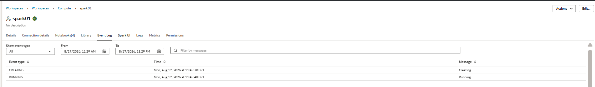

**Spark UI:** é o principal painel para debug e análise de planos de execução spark

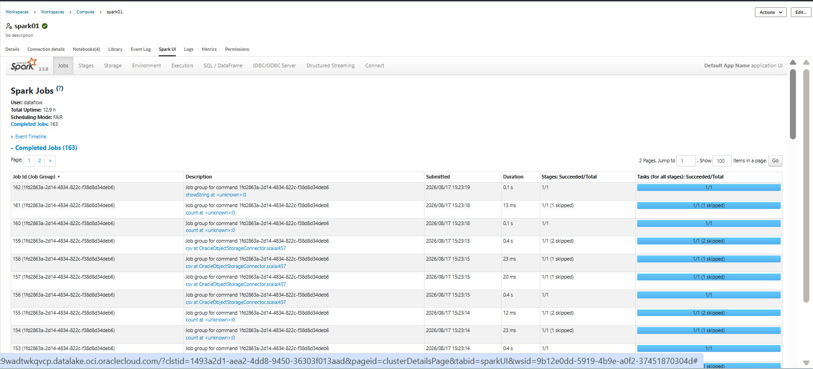

**Logs:** mostra os logs do drivers e executores

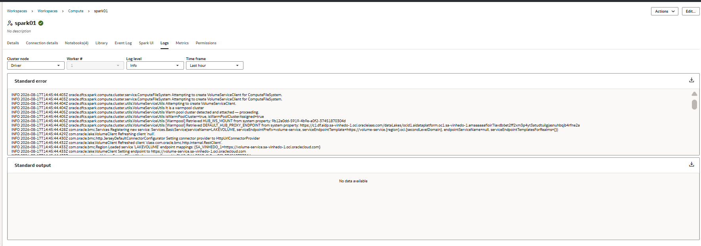

**Metrics:** mostra métricas de alocação de recurso pelo cluster

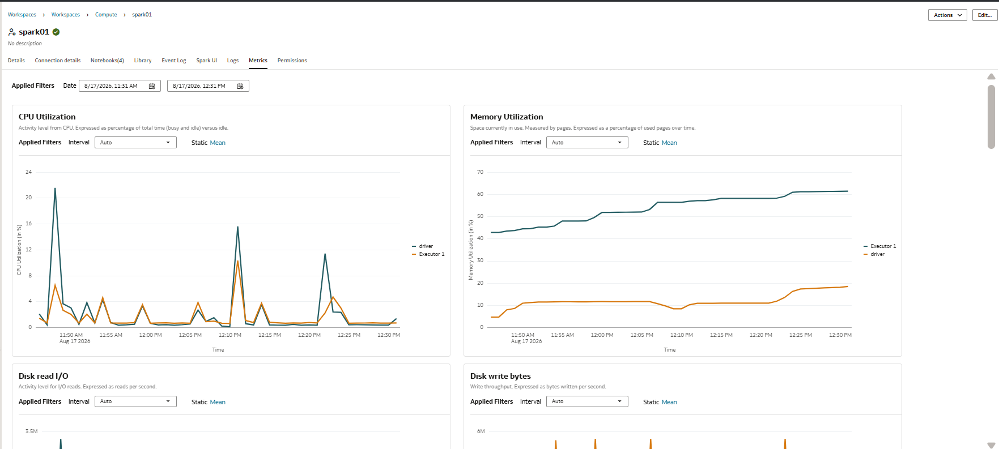

- A documentação pública OCI que aborda recomendações e boas práticas de tunning é: https://docs.oracle.com/en-us/iaas/Content/data-flow/using/dfs_administer_data_flow.htm
- A documentação pública OCI que aborda recomendações de sizing é: https://docs.oracle.com/en-us/iaas/Content/data-flow/using/dfs_tips_for_app_default_size.htm

## **5️⃣ Adaptando códigos do AIDP para rodar no OCI Data Flow**

A documentação Oracle passa algumas recomendações para que possamos adaptar aplicações e scripts spark para execução no OCI Data Flow, abaixo as principais em destaque:
- https://docs.oracle.com/en-us/iaas/Content/data-flow/tutorial/migrate-spark-apps/front.htm 
- https://docs.oracle.com/en-us/iaas/Content/data-flow/using/dfs_import_spark_app_to_cloud.htm
- https://docs.oracle.com/en-us/iaas/Content/data-flow/using/third-party-provide-archive.htm
- https://docs.oracle.com/en-us/iaas/Content/data-flow/using/dfs_application_parameters.htm
- https://docs.oracle.com/en-us/iaas/Content/data-flow/using/dfs_provide_jvm_options.htm
- https://docs.oracle.com/en-us/iaas/Content/data-flow/tutorial/develop-apps-locally/front.htm
- https://docs.oracle.com/en-us/iaas/Content/data-flow/using/spark_oracle_ds_examples.htm#spark_oracle_ds_example_py
- https://docs.oracle.com/en-us/iaas/Content/data-flow/using/migrate-later-spark.htm

Nos exemplos que criamos nesse hands on buscamos **não utilizar o catálogo de dados afim de garantir a compatibilidade entre AI Data Platform e OCI Data Flow**. 
1. No AIDP e OCI Data Science o contexto da sessão é criado automaticamente, para o data flow temos que adicionar no começo de nosso código 

``` python
from pyspark.sql import SparkSession
...
spark = SparkSession.builder.appName("My App").getOrCreate()
```

2. Nas interações com object storage usamos **oci://** para referenciar arquivos e paths
3. Nas interações com o Autonomous fizemos o encoding da wallet e a usamos por exemplo o seguinte procedimento

``` python
    spark.read
    .format("aidataplatform")
    .option("type", "ORACLE_ALH")
    .option("tns", "adb01_high")
    .option("wallet.content", <wallet encoded>)
    .option("user.name", "ADMIN")
    .option("password", "WORKSHOPsec2019##")
    .option("schema", "ADMIN")
    .option("table", "CUSTOMER_CLASS_AGG_REVIEW")
    .load()
```

No código acima o procedimento existe apenas para o AI Data Platform, temos que buscar um sintaxe compatível com o OCI Data Flow para correto funcionamento de nossas aplicações. 
A documentação que nos ajuda é:
- https://github.com/oracle-samples/oracle-dataflow-samples/tree/main/python/loadadw_simplified
- https://docs.oracle.com/en-us/iaas/Content/data-flow/using/spark_oracle_ds_examples.htm#spark_oracle_ds_example_py

Seguindo o exemplo temos
``` python
    spark.read
    .format("oracle") \
    .option("walletUri","oci://bucket01@TROCAR_AQUI_NAMESPACE/Wallet_DATABASE.zip") \
    .option("connectionId","adb01_high") \
    .option("dbtable", "CUSTOMER_CLASS_AGG_REVIEW") \
    .option("user", "ADMIN") \
    .option("password", "WORKSHOPsec2019##") \
    .load()
```

-----

Abaixo o script que usaremos e faremos a adequação: script_silver.py

**Versão AIDP**
``` python
from pyspark.sql import functions as F
import base64

oss_path = "oci://bucket01@TROCAR_AQUI_NAMESPACE"
base_path = f"{oss_path}/parquet"
catalog_location = f"{oss_path}/staging"
orders_path = f"{base_path}/orders"
customers_path = f"{base_path}/customers"
wallet_uri = f"{oss_path}/wallet/wallet_adb01.zip"

# Oracle ADB / AI Lakehouse
alh_tns = "adb01_high"
alh_user = "ADMIN"
alh_password = "WORKSHOPsec2019##"
alh_schema = "ADMIN"
target_table = "CUSTOMERS_ORDERS"

df_orders = spark.read.parquet(orders_path)
df_customers = spark.read.parquet(customers_path)

print(f"Orders:    {df_orders.count()}")
print(f"Customers: {df_customers.count()}")


df_join = (
    df_orders.alias("o")
    .join(
        df_customers.alias("c"),
        on="CUSTOMER_ID",
        how="inner"
    )
)

silver_df = df_join.select(
    F.col("CUSTOMER_ID"),
    F.col("ORDER_ID"),
    F.col("ORDER_DATE"),
    F.col("ORDER_MODE"),
    F.col("ORDER_STATUS"),
    F.col("ORDER_TOTAL"),
    F.col("SALES_REP_ID"),
    F.col("PROMOTION_ID"),
    F.col("WAREHOUSE_ID"),
    F.col("DELIVERY_TYPE"),
    F.col("COST_OF_DELIVERY"),
    F.col("WAIT_TILL_ALL_AVAILABLE"),
    F.col("DELIVERY_ADDRESS_ID"),
    F.col("o.CUSTOMER_CLASS").alias("ORDER_CUSTOMER_CLASS"),
    F.col("CARD_ID"),
    F.col("INVOICE_ADDRESS_ID"),
    F.col("CUST_FIRST_NAME"),
    F.col("CUST_LAST_NAME"),
    F.col("NLS_LANGUAGE"),
    F.col("NLS_TERRITORY"),
    F.col("CREDIT_LIMIT"),
    F.col("CUST_EMAIL"),
    F.col("ACCOUNT_MGR_ID"),
    F.col("CUSTOMER_SINCE"),
    F.col("c.CUSTOMER_CLASS").alias("CUSTOMER_CLASS"),
    F.col("SUGGESTIONS"),
    F.col("DOB"),
    F.col("MAILSHOT"),
    F.col("PARTNER_MAILSHOT"),
    F.col("PREFERRED_ADDRESS"),
    F.col("PREFERRED_CARD")
)

silver_df = (
    silver_df
    .withColumn(
        "ORDER_DATE",
        F.to_timestamp(
            F.trim(F.col("ORDER_DATE")),
            "dd-MMM-yy hh.mm.ss.SSSSSS a"
        )
    )
    .withColumn(
        "CUSTOMER_SINCE",
        F.to_date(
            F.trim(F.col("CUSTOMER_SINCE")),
            "dd-MMM-yy"
        )
    )
    .withColumn(
        "DOB",
        F.to_date(
            F.trim(F.col("DOB")),
            "dd-MMM-yy"
        )
    )
)

row_count = silver_df.count()
print(f"Silver row count: {row_count}")

silver_df.printSchema()
silver_df.show(10, truncate=False)
print("Carregando wallet...")

wallet_df = (
    spark.read
    .format("binaryFile")
    .load(wallet_uri)
)

wallet_rows = wallet_df.select("content").collect()

if len(wallet_rows) != 1:
    raise RuntimeError(
        f"Esperado exatamente 1 arquivo de wallet, "
        f"mas foram encontrados {len(wallet_rows)}."
    )

wallet_bytes = wallet_rows[0]["content"]

if not wallet_bytes:
    raise RuntimeError("wallet.zip está vazio.")

print(f"Wallet carregada: {len(wallet_bytes)} bytes")

wallet_content = (
    base64
    .b64encode(wallet_bytes)
    .decode("ascii")
)

print(
    f"Wallet convertida para Base64: "
    f"{len(wallet_content)} caracteres"
)

print(
    f"Gravando {row_count} linhas em "
    f"{alh_schema}.{target_table}..."
)

(
    silver_df.write
    .format("aidataplatform")
    .mode("overwrite")
    .option("type", "ORACLE_ALH")
    .option("tns", alh_tns)
    .option("wallet.content", wallet_content)
    .option("user.name", alh_user)
    .option("password", alh_password)
    .option("schema", alh_schema)
    .option("table", target_table)
    .option("catalog_location", catalog_location)
    .save()
)

print(
    f"Dados gravados com sucesso em "
    f"{alh_schema}.{target_table}"
)
```

Crie um arquivo no seu desktop, dê o nome de `script_silver.py`, copie e cole o conteudo abaixo, faça a alteração do NAMESPACE para o seu ambiente e salve o arquivo

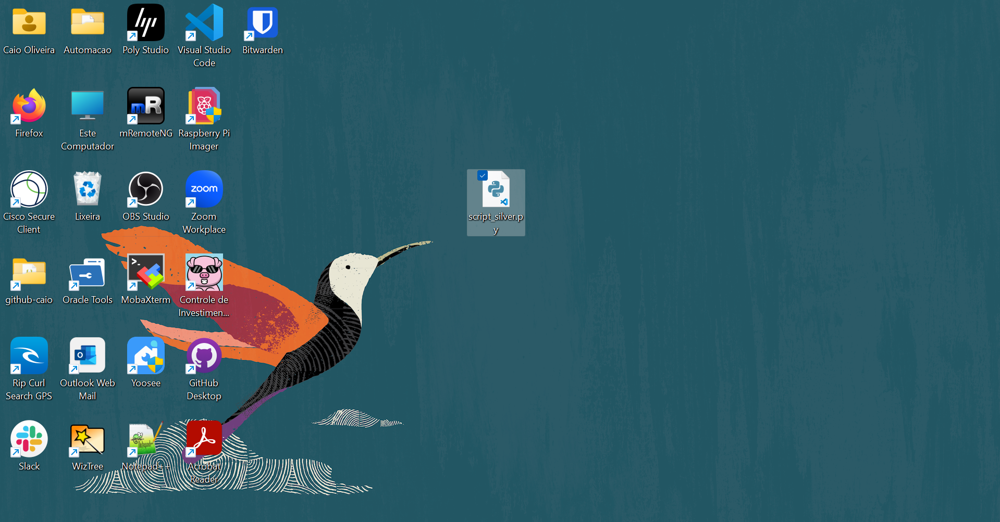

**Versão OCI Data Flow**
```python
from pyspark.sql import SparkSession
from pyspark.sql import functions as F
import base64

oss_path = "oci://bucket01@TROCAR_AQUI_NAMESPACE"
base_path = f"{oss_path}/parquet"
catalog_location = f"{oss_path}/staging"
orders_path = f"{base_path}/orders"
customers_path = f"{base_path}/customers"
wallet_uri = f"{oss_path}/wallet/wallet_adb01.zip"

# Oracle ADB / AI Lakehouse
alh_tns = "adb01_high"
alh_user = "ADMIN"
alh_password = "WORKSHOPsec2019##"
alh_schema = "ADMIN"
target_table = "CUSTOMERS_ORDERS"

spark = SparkSession.builder.appName("My App").getOrCreate()

df_orders = spark.read.parquet(orders_path)
df_customers = spark.read.parquet(customers_path)

print(f"Orders:    {df_orders.count()}")
print(f"Customers: {df_customers.count()}")

df_join = (
    df_orders.alias("o")
    .join(
        df_customers.alias("c"),
        on="CUSTOMER_ID",
        how="inner"
    )
)

silver_df = df_join.select(
    F.col("CUSTOMER_ID"),
    F.col("ORDER_ID"),
    F.col("ORDER_DATE"),
    F.col("ORDER_MODE"),
    F.col("ORDER_STATUS"),
    F.col("ORDER_TOTAL"),
    F.col("SALES_REP_ID"),
    F.col("PROMOTION_ID"),
    F.col("WAREHOUSE_ID"),
    F.col("DELIVERY_TYPE"),
    F.col("COST_OF_DELIVERY"),
    F.col("WAIT_TILL_ALL_AVAILABLE"),
    F.col("DELIVERY_ADDRESS_ID"),
    F.col("o.CUSTOMER_CLASS").alias("ORDER_CUSTOMER_CLASS"),
    F.col("CARD_ID"),
    F.col("INVOICE_ADDRESS_ID"),
    F.col("CUST_FIRST_NAME"),
    F.col("CUST_LAST_NAME"),
    F.col("NLS_LANGUAGE"),
    F.col("NLS_TERRITORY"),
    F.col("CREDIT_LIMIT"),
    F.col("CUST_EMAIL"),
    F.col("ACCOUNT_MGR_ID"),
    F.col("CUSTOMER_SINCE"),
    F.col("c.CUSTOMER_CLASS").alias("CUSTOMER_CLASS"),
    F.col("SUGGESTIONS"),
    F.col("DOB"),
    F.col("MAILSHOT"),
    F.col("PARTNER_MAILSHOT"),
    F.col("PREFERRED_ADDRESS"),
    F.col("PREFERRED_CARD")
)

silver_df = (
    silver_df
    .withColumn(
        "ORDER_DATE",
        F.to_timestamp(
            F.trim(F.col("ORDER_DATE")),
            "dd-MMM-yy hh.mm.ss.SSSSSS a"
        )
    )
    .withColumn(
        "CUSTOMER_SINCE",
        F.to_date(
            F.trim(F.col("CUSTOMER_SINCE")),
            "dd-MMM-yy"
        )
    )
    .withColumn(
        "DOB",
        F.to_date(
            F.trim(F.col("DOB")),
            "dd-MMM-yy"
        )
    )
)

row_count = silver_df.count()
print(f"Silver row count: {row_count}")

silver_df.printSchema()
silver_df.show(10, truncate=False)
print("Carregando wallet...")

wallet_df = (
    spark.read
    .format("binaryFile")
    .load(wallet_uri)
)

wallet_rows = wallet_df.select("content").collect()

if len(wallet_rows) != 1:
    raise RuntimeError(
        f"Esperado exatamente 1 arquivo de wallet, "
        f"mas foram encontrados {len(wallet_rows)}."
    )

wallet_bytes = wallet_rows[0]["content"]

if not wallet_bytes:
    raise RuntimeError("wallet.zip está vazio.")

print(f"Wallet carregada: {len(wallet_bytes)} bytes")

wallet_content = (
    base64
    .b64encode(wallet_bytes)
    .decode("ascii")
)

print(
    f"Wallet convertida para Base64: "
    f"{len(wallet_content)} caracteres"
)

print(
    f"Gravando {row_count} linhas em "
    f"{alh_schema}.{target_table}..."
)

(
    silver_df.write
    .format("oracle")
    .mode("overwrite")
    .option("walletUri", wallet_uri) \
    .option("connectionId",alh_tns) \
    .option("dbtable", target_table) \
    .option("user", alh_schema) \
    .option("password", alh_password)
    .save()
)

print(
    f"Dados gravados com sucesso em "
    f"{alh_schema}.{target_table}"
)
```

Agora no OCI vamos até o object storage e teremos que criar 2 novos buckets: `spark_apps` e `spark_logs`

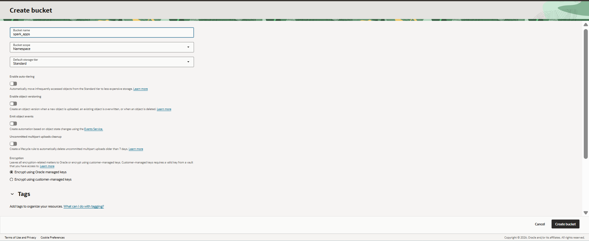

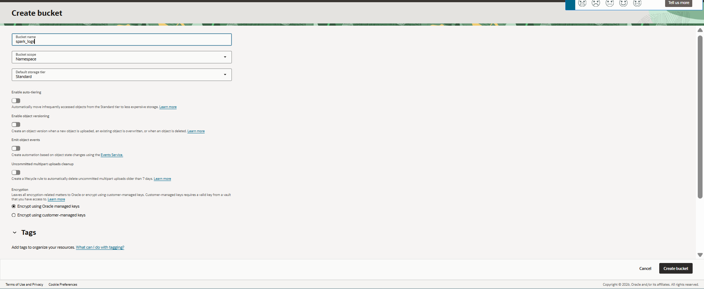

Faça o upload do arquivo criado em seu desktop para o `spark_apps`

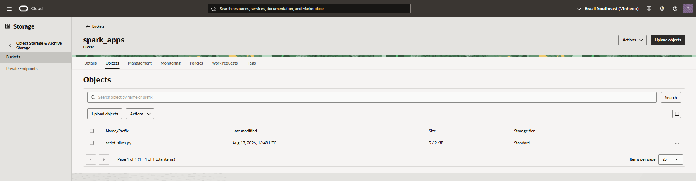

Agora vá até o data flow

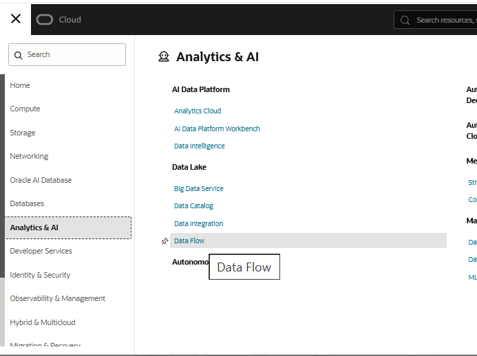

Faça a criação do data flow app, vá preenchendo conforme o exemplo abaixo

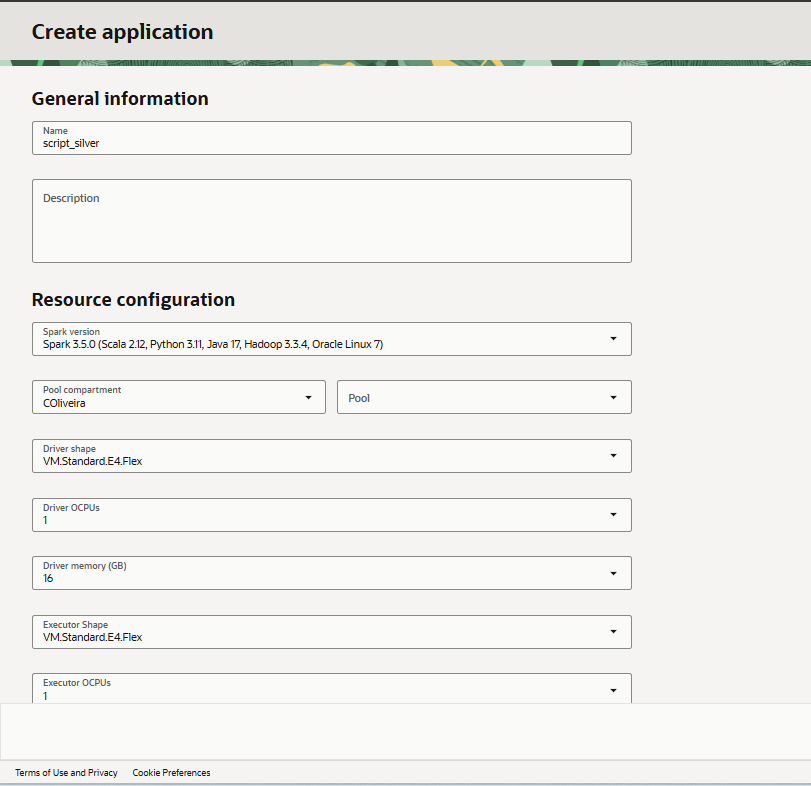

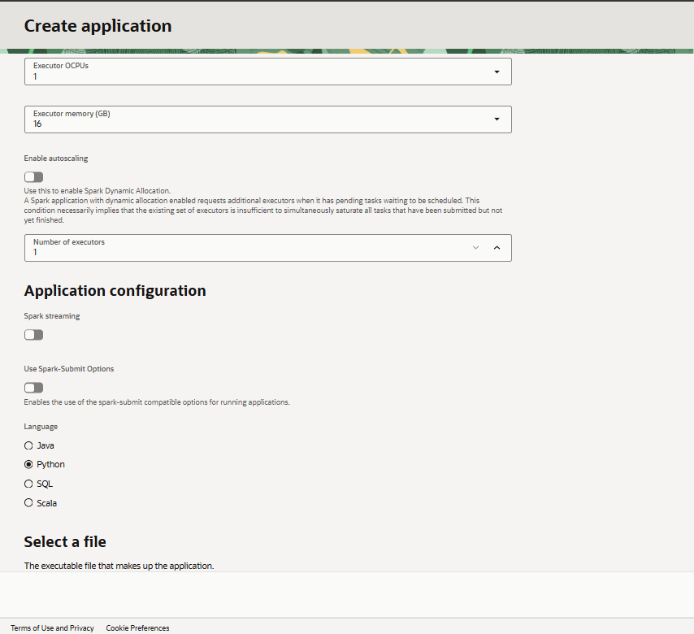

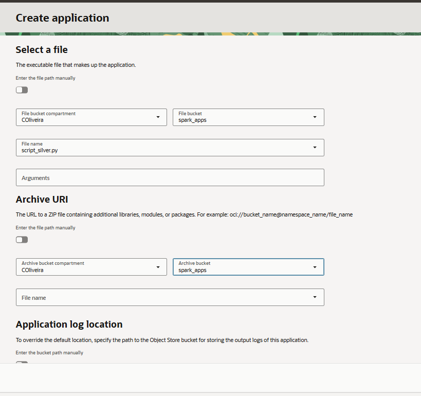

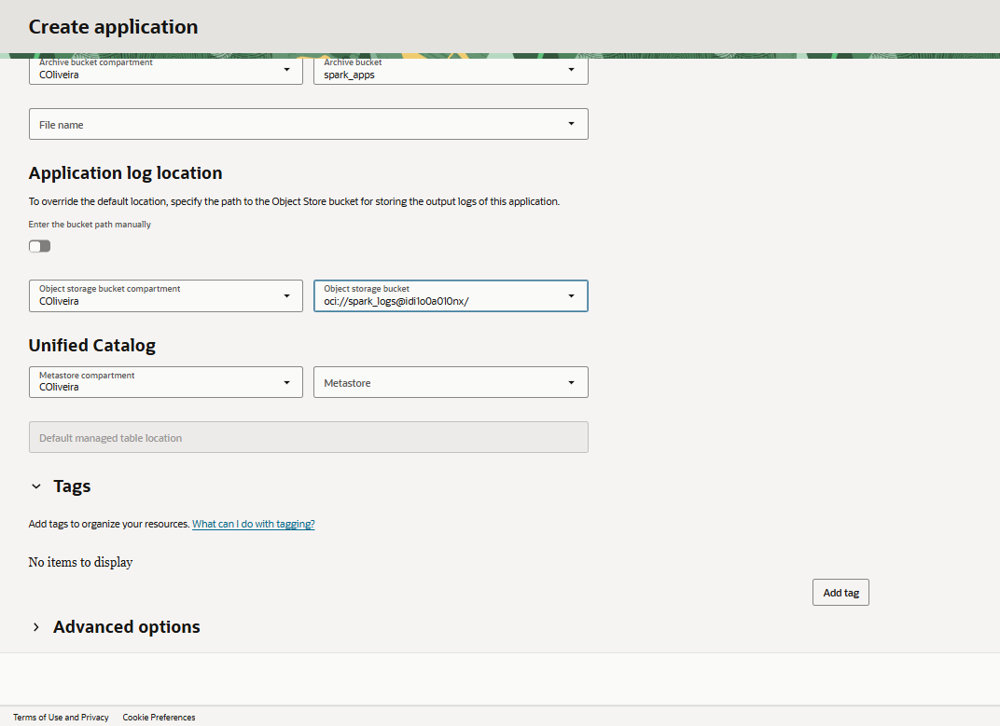

Na parte de configurações avançadas escolha enable oracle datasources

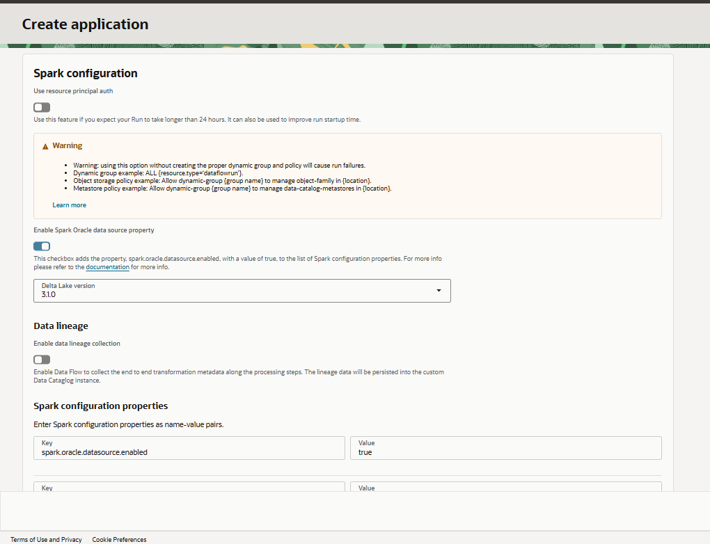

Criada a aplicação, clique em run

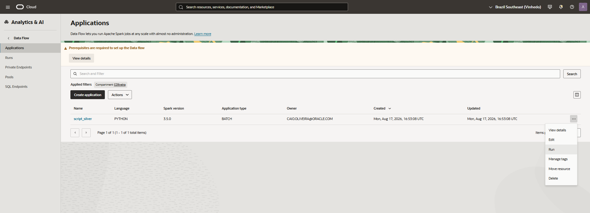

Aceite as configurações default e dê run

Aguarde uns minutos e clique em monitoring. Obs: O status accepted significa que esta em wait na fila para execução.

Na aba monitoring vamos ter acesso aos logs de execução e a Spark UI para debug e diagnostico da execução

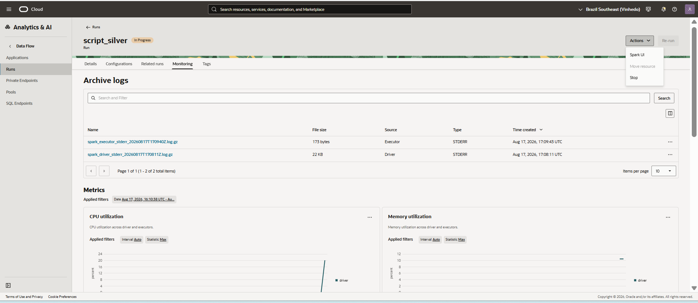

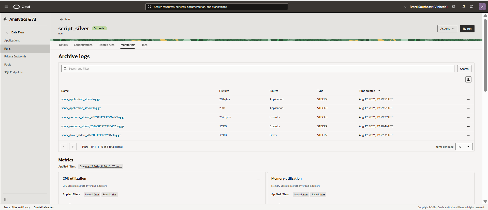

Clique no log `spark_application_stdout.log.gz` e verá o output similar ao que temos enquanto estamos testando a aplicação no AIDP

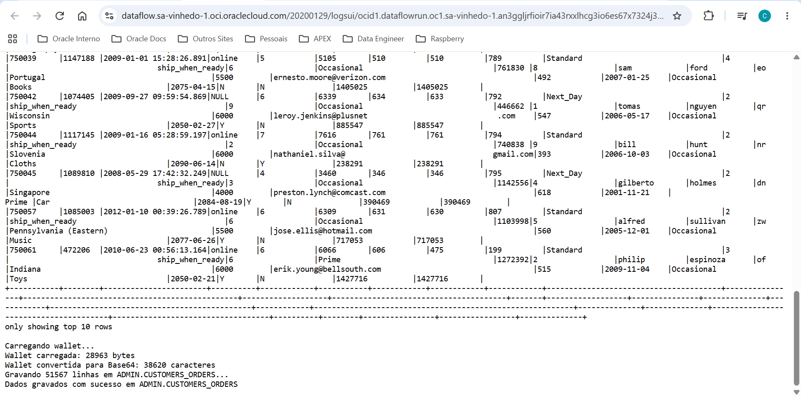

------------------------------------------------------------------------

## **✅ Laboratório finalizado!**

Parabéns! Você concluiu o hands-on do OCI AI Data Platform (AIDP), construindo as camadas Bronze, Silver e Gold, utilizando o Autonomous Database para persistência e consumo dos dados processados e adaptando a aplicação desenvolvida no AIDP para execução no OCI Data Flow.

Ao longo do laboratório, você passou pela preparação da infraestrutura, desenvolvimento e execução de aplicações PySpark, análise exploratória e qualidade dos dados, construção da arquitetura medalhão, integração com o Autonomous Database, utilização das ferramentas de monitoramento e debug do Spark e, por fim, reutilização do código desenvolvido no AIDP para deployment no OCI Data Flow.

Com isso, você percorreu um fluxo de desenvolvimento fim a fim, desde a experimentação e desenvolvimento no OCI AI Data Platform até a execução da aplicação Spark no OCI Data Flow.


## 👥 Agradecimentos

- **Autores** - Caio Oliveira
- **Autores Contribuintes** - Isabelle Anjos
- **Última atualização** - Agosto de 2026

## 🛡️ Declaração de Porto Seguro (Safe Harbor)

O tutorial apresentado tem como objetivo traçar a orientação dos nossos produtos em geral. É destinado somente a fins informativos e não pode ser incorporado a um contrato. Ele não representa um compromisso de entrega de qualquer tipo de material, código ou funcionalidade e não deve ser considerado em decisões de compra. O desenvolvimento, a liberação, a data de disponibilidade e a precificação de quaisquer funcionalidades ou recursos descritos para produtos da Oracle estão sujeitos a mudanças e são de critério exclusivo da Oracle Corporation.

Esta é a tradução de uma apresentação em inglês preparada para a sede da Oracle nos Estados Unidos. A tradução é realizada como cortesia e não está isenta de erros. Os recursos e funcionalidades podem não estar disponíveis em todos os países e idiomas. Caso tenha dúvidas, entre em contato com o representante de vendas da Oracle. 
